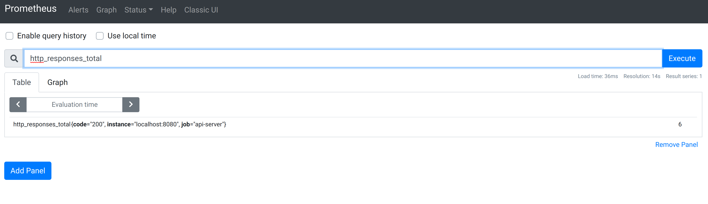
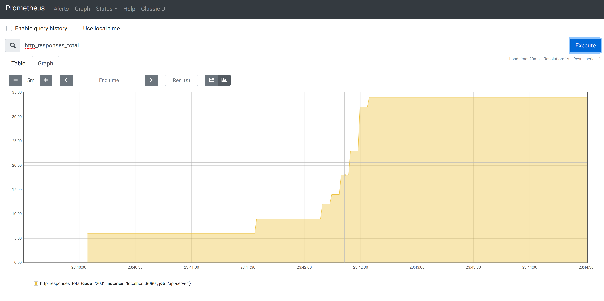

# Lesson 2: Instrumenting Your Application - Prometheus Metrics

Continuin from [lesson 1](../lesson-001-web-server-cli/), we will now add
metrics to our server.


## Table of Contents

* [Getting Started](#getting-started)
* [Adding Basic Metrics](#adding-basic-metrics)
* [Creating Your Custom Metrics](#creating-your-custom-metrics)
* [Visualizing Our Metrics](#visualizing-our-metrics)
* [References](#references)

## Getting Started

Instrumenting your application is one of those things that will allow you to
trully be able to runyour code in production.
Metrics are meant to help you understand, in a non-intrusive way, what is going
on in your code at all times.
Without knowing data, development is just bad guessing.
With good data (with metrics), development can still be guessing but it will at
least be a bit more informed.

For our little experiment here, we will work on surfacing Prometheus-type
metrics since Prometheus is one of the good monitoring solutions that are out
there and probably the most common one.

Before we actually start with any code or technical things it is useful to put
this readme into perspective.
The work here is intended to give you a hands-on experience with metrics in a
non-trivial but relatively simple environment.
This is meant to spike your interest and by no means is this readme the whole
story.
Thus we will recommend some reading and mention some keywords to help guide you
in your search for more information.

**Note:** We highly recommend that you read this twice. Start by skimming
through it, and playing with the code. Once you have tred things out yourself,
read it again and make sure you understand the details :smile:.

## Adding Basic Metrics

You are gonna love this!
Thanks to the awesome Go client library,
https://github.com/prometheus/client_golang/, we can actually get a lot of very
useful metrics with just 2 lines of code.

In [app/server.go](./app/server.go) add the following:
```go
import (
  ...
  "github.com/prometheus/client_golang/prometheus/promhttp"
)

// Run registers http handlers to endpoints and starts the web server.
func Run(addr string) error {
  ...
  mux.Handle("/metrics", promhttp.Handler())
  ...
}
```

and :tada: you now now have metrics!
And we should go check them out.

Run the server
```
$ go build -o server&& ./server
2020/07/11 17:58:34 version: v1.0.0
2020/07/11 17:58:34 args: []string{}
2020/07/11 17:58:34 starting server at 0.0.0.0:8080
```

and on your browser go to http://0.0.0.0:8080/metrics.

You should now be looking at some very useful metrics (and examples of what
good metrics look like)
```
# HELP go_goroutines Number of goroutines that currently exist.
# TYPE go_goroutines gauge
go_goroutines 8
...
# HELP go_threads Number of OS threads created.
# TYPE go_threads gauge
go_threads 10
# HELP process_cpu_seconds_total Total user and system CPU time spent in seconds.
# TYPE process_cpu_seconds_total counter
process_cpu_seconds_total 0
...
# HELP process_open_fds Number of open file descriptors.
# TYPE process_open_fds gauge
process_open_fds 8
...
```

## Creating Your Custom Metrics

Next step, to add metrics to our server.
We will add the metric `http_responses_total`.
This one will give us an idea of how to go about adding any kind of metric one
may possible need.

The number of responses is a metric that increases - it doesn't make sense to
decrease the number of total http responses (you can't take a response back).
As such, a `counter` would be metric type to use.

Furthermore, in order to allow the possibility for keeping track of what kind
of response it was (e.g., 200, 400, 500) we will add a "dimension" for the
status code.
This dimension is implemented via a label (keep this idea in mind, later on we
will visualize these dimensions).

The simplest definition of a counter could looke like
```go
responsesTotal = prometheus.NewCounter(
  prometheus.CounterOpts{
    Namespace: "http",
    Name:      "responses_total",
    Help:      "Total http responses",
  })
```

Such a counter has a `Inc()` and an `Add(float64)` methods, see the godoc page
https://godoc.org/github.com/prometheus/client_golang/prometheus#Counter,
Which means we could use our counter above as

```go
func homeHandler(w http.ResponseWriter, r *http.Request) {
  ...
  // Increase our responses total counter by 1.
  responsesTotal.Inc()
}
```

But because we want labels, we need to use a `CounterVec` instead of a plain
counter.
Or as explained in the GoDoc page

> In addition to the fundamental metric types Gauge, Counter, Summary, and
> Histogram, a very important part of the Prometheus data model is the
> partitioning of samples along dimensions called labels, which results in
> metric vectors. The fundamental types are GaugeVec, CounterVec, SummaryVec,
> and HistogramVec.

A "metric vector" being a collection of all instances of the metric with
different label values (pretty similar to how a vecotr in mathematics can
define position in multidimensional spaces, if yah think about it).

Our counter will now look like
```go
responsesTotal = prometheus.NewCounterVec(
  prometheus.CounterOpts{
    Namespace: "http",
    Name:      "responses_total",
    Help:      "Total http responses",
  },
  []string{
    // HTTP status code.
    "code",
  },
)
```

you can see it in [app/metrics.go](./app/metrics.go).
You will also notice we define a `RegisterMetrics()` functions which is
ESSENTIAL!
If we don't register our metrics then they will not show.

We register our `responsesTotal` metric in the function `NewServerCommand()`
over in [app/server.go](./app/server.go)
```go
func NewServerCommand() *cobra.Command {
  ...
  // Register metrics.
  RegisterMetrics()
  ...
}
```

And to use our counter (that can have a value set for the http response status
code) we can do something like
```go
responsesTotal.With(prometheus.Labels{"code": "200"}).Inc()
```

Which will increase by 1 the total number of http responses (with status code
200).
Similarly, in the case of a 500 status code
```go
responsesTotal.With(prometheus.Labels{"code": "500"}).Inc()
```


The code in this directory already has this all setup for you.
If you go ahead and run it, you will see our metric showing up in
http://0.0.0.0:8080/metrics.

If you query out home endpoint you will see the counter increasing.
For example, after a couple `curl http://0.0.0.0/` we had
```
# HELP http_responses_total Total http responses
# TYPE http_responses_total counter
http_responses_total{code="200"} 5
```

Now that you have this basic example you can build anything.
All other metric types are used in a similar manner.
If you want to see more examples, always check out the godoc page for the Go
prometheus client https://godoc.org/github.com/prometheus/client_golang/prometheus.

## Visualizing Our Metrics

Since we have our Prometheus-style metrics, let's actually see them!
So time to run Prometheus :rocket:.

We will use the latest Prometheus release (at the time of this writing).
You can see all releases in https://github.com/prometheus/prometheus/releases.

Because we want to be fancy, we will run Prometheus in a container,
https://github.com/prometheus/prometheus#docker-images.
```
$ docker run --rm -it --network host -v ${PWD}/config/prometheus.yml:/etc/prometheus/prometheus.yml quay.io/prometheus/prometheus:v2.19.2
level=info ts=2020-07-11T23:39:58.520Z caller=main.go:302 msg="No time or size retention was set so using the default time retention" duration=15d
level=info ts=2020-07-11T23:39:58.520Z caller=main.go:337 msg="Starting Prometheus" version="(version=2.19.2, branch=HEAD, revision=c448ada63d83002e9c1d2c9f84e09f55a61f0ff7)"
level=info ts=2020-07-11T23:39:58.520Z caller=main.go:338 build_context="(go=go1.14.4, user=root@dd72efe1549d, date=20200626-09:02:20)"
level=info ts=2020-07-11T23:39:58.520Z caller=main.go:339 host_details="(Linux 5.3.18-050318-generic #201912181133 SMP Wed Dec 18 16:36:09 UTC 2019 x86_64 alejandrox1-N501VW (none))"
level=info ts=2020-07-11T23:39:58.520Z caller=main.go:340 fd_limits="(soft=1048576, hard=1048576)"
level=info ts=2020-07-11T23:39:58.520Z caller=main.go:341 vm_limits="(soft=unlimited, hard=unlimited)"
level=info ts=2020-07-11T23:39:58.521Z caller=main.go:678 msg="Starting TSDB ..."
level=info ts=2020-07-11T23:39:58.521Z caller=web.go:524 component=web msg="Start listening for connections" address=0.0.0.0:9090
level=info ts=2020-07-11T23:39:58.525Z caller=head.go:645 component=tsdb msg="Replaying WAL and on-disk memory mappable chunks if any, this may take a while"
level=info ts=2020-07-11T23:39:58.525Z caller=head.go:706 component=tsdb msg="WAL segment loaded" segment=0 maxSegment=0
level=info ts=2020-07-11T23:39:58.525Z caller=head.go:709 component=tsdb msg="WAL replay completed" duration=338.231µs
level=info ts=2020-07-11T23:39:58.526Z caller=main.go:694 fs_type=EXT4_SUPER_MAGIC
level=info ts=2020-07-11T23:39:58.526Z caller=main.go:695 msg="TSDB started"
level=info ts=2020-07-11T23:39:58.526Z caller=main.go:799 msg="Loading configuration file" filename=/etc/prometheus/prometheus.yml
level=info ts=2020-07-11T23:39:58.527Z caller=main.go:827 msg="Completed loading of configuration file" filename=/etc/prometheus/prometheus.yml
level=info ts=2020-07-11T23:39:58.527Z caller=main.go:646 msg="Server is ready to receive web requests."
```

Couple things to notice:
* We are running Prometheus using the host Docker network (`--network host`).
  This means that Prometheus will be available to us in http:/localhost:9090
  and that Prometheus will be able to scrape metrics from our server (which is
  using port 8080). If we were running Prometheus with something like `-p
  9090:9090` then we would be able to see Prometheus in http://localhost:9090
  but Prometheus would not be able to scrape metrics from our app.
* We are mounting [config/prometheus.yml](./config/prometheus.yml) as a volume
  into the container. We are putting this file in
  `/etc/prometheus/prometheus.yml` inside of the contiainer, which is the
  default location for Prometheus to look for its configuration. For details
  about the Promtheus' configuration see
  https://github.com/prometheus/prometheus/blob/master/docs/getting_started.md.

If you now go to http://localhost:9090 and execute the Prometheus query
```
http_responses_total
```

You will see the following


You will see our metric, with its current value of 6 and its labels (the
`job_name` is specified by the Prometheus configuration file
[config/prometheus.yml](./config/prometheus.yml)).

A cool thing to do would be to click on "Graph", under our query and see the
value of our metric over time.
After doing a couple more `curl http://localhost:8080/` we had the following



## References

Some good reading material that will give you more context:
* [Prometheus Documentation: Best Practices - INSTRUMENTATION](https://prometheus.io/docs/practices/instrumentation/)
* [Prometheus metrics / OpenMetrics code instrumentation](https://sysdig.com/blog/prometheus-metrics/)
* [Prometheus Blog Series (Part 4): Instrumenting code in Go and Java](https://blog.pvincent.io/2017/12/prometheus-blog-series-part-4-instrumenting-code-in-go-and-java/)
